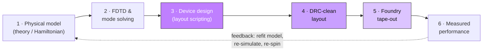

# Topological-Photonics-GDS-design

> **2025 version.** Based on [SupratikSarkar/Topological-Photonics-GDS-design](https://github.com/SupratikSarkar/Topological-Photonics-GDS-design), with my own modifications. Requires **Python 3.12** and **gdsfactory `~=9.14.0`** (tested with 9.14.2). The **Ligentec AN800 PDK** (`an800-gdsfactory`) is required separately for the edge-coupler design and is **not included in this repository** — obtain it from the foundry.

Python code that uses **gdsfactory** to generate GDS chip-design files for
topological photonics lattices (both integer and anomalous quantum Hall),
following:

1. Sunil Mittal _et al_. A topological source of quantum light. **Nature** **561**, 502–506 (2018). DOI:[10.1038/s41586-018-0478-3](https://www.nature.com/articles/s41586-018-0478-3)
2. Christopher J. Flower _et al_., Observation of topological frequency combs. **Science** **384**, 1356-1361 (2024). DOI:[10.1126/science.ado0053](https://www.science.org/doi/full/10.1126/science.ado0053)
3. Lida Xu _et al_., On-chip multi-timescale spatiotemporal optical synchronization. **Science Advances** **11**, eadw7696 (2025). DOI:[10.1126/sciadv.adw7696](https://www.science.org/doi/full/10.1126/sciadv.adw7696)
4. Mahmoud Jalali Mehrabad _et al_., Multi-timescale frequency-phase matching for high-yield nonlinear photonics. **Science** **390**, 612-616 (2025). DOI:[10.1126/science.adu6368](https://www.science.org/doi/full/10.1126/science.adu6368)

**Contents**
- [The design pipeline — a 101](#the-design-pipeline--a-101)
- [Where this repo sits](#where-this-repo-sits)
- [What the notebooks build](#what-the-notebooks-build)
- [Local environment & how to run](#local-environment--how-to-run)

---

## The design pipeline — a 101

How an integrated-photonics chip goes from *an idea in a Hamiltonian* to
*numbers measured on a probe station*. Six stages:



**This repo owns stage 3** (highlighted), runs stage 4 locally, and produces
the stage-5 GDS. It is written against physics targets from stages 1–2 and
feeds the devices measured in stage 6.

### 1 · Physical model — *what do we want the light to do?*

You start from physics, not geometry: what **Hamiltonian** (or band
structure) should the chip realize? For topological photonics that is a
**tight-binding model** — a lattice of optical resonators ("sites") with
hopping between neighbours, plus an engineered **synthetic gauge field** so
photons feel an effective magnetic field and the lattice grows topological
edge states. The knobs it hands downstream are concrete:

- **resonant frequency** of each site → ring circumference
- **hopping strength `J`** between sites → ring-to-ring gap
- **on-site loss / quality factor `Q`** → bend radius, waveguide width
- **synthetic flux per plaquette** → link-ring geometry

Output: a **target parameter table**, not a drawing. (Literature: Mittal 2018,
Flower 2024, above.)

### 2 · FDTD & mode solving — *turn physics targets into geometry numbers*

The model says "I need `Q = 10⁶` and hopping `J = 20 GHz`"; simulation turns
that into **micrometres**.

**Mode solving (2-D cross-section)** — guided modes of a waveguide cross-section:

- **effective index `n_eff`** → resonance condition
- **group index `n_g`** → free-spectral range `FSR = c / (n_g · L)`
- **mode profile** → evanescent tail reach → coupling vs. gap
- **single-mode width window** → safe waveguide width (≈ 1.2 µm on AN800)

*Tools:* Lumerical MODE, Tidy3D, femwell, MPB.

**FDTD (3-D device)** — march Maxwell's equations on a grid through a real device:

- coupler transmission vs. gap (the `J` ↔ gap calibration)
- bend loss vs. radius (validates the Euler-bend choice)
- coupler insertion loss and bandwidth

*Tools:* Lumerical FDTD, Tidy3D, Meep.

Output: a **filled-in geometry table** — radius, width, gap, coupler length —
the exact numbers typed into the layout script. (The AN800 PDK ships compact
models in `an800/models/*`, but they need a GDSFactory+ licence; this repo
does not run them — it consumes numbers produced elsewhere.)

### 3 · Device design — *draw the chip, in code*  ⟵ **this repo**

Translate the geometry table into a layout: polygons on specific layers,
connected into rings, chains, and lattices, wired out to optical I/O.
Modern practice is **layout-as-code** — parametric, diff-able, reproducible —
here with **gdsfactory**. Building blocks, bottom-up:

| Concept | In the repo |
|---|---|
| waveguide cross-section (width + layer) | `cross_section(width=..., layer=(2,0))` |
| low-loss 90° bend | `bend_euler` (curvature ramps smoothly → less scatter) |
| resonator (a "site") | `ring_resonator_euler` — four Euler bends + four straights |
| bus waveguide / I/O | `io_Coupler_*`, edge or grating coupler |
| 1-D coupled-ring chain (a CROW) | `ring_chain` — the tight-binding chain |
| 2-D IQHE / AQHE lattice | `## AQHE / IQHE lattice` cell — the real topological device |
| ring-of-rings plaquettes | `## IQHE - ring of rings` cell |

Two ideas do all the work:

1. **`cross_section` = a recipe; `straight`/`bend`/`taper` = parts extruded
   along a path.** Shape and trajectory are separated.
2. **`connect("o1", other.ports["o2"])` = assembly by *relationship*, not
   coordinates.** Ring-to-ring spacing, though, is set by explicit `move()` —
   because evanescent coupling needs a precise, sub-micron *gap*, which must
   not be a hard connection.

Physical thread: **one ring = one tight-binding site; the sub-micron gap = the
hopping `J`.** A 1-D chain is a 1-D lattice; tile it in 2-D and add flux via
the link rings and you have the quantum-Hall lattice in the repo's title.

Output: a **GDS file** — the universal layout interchange format.

### 4 · DRC-clean layout — *will the foundry actually make it?*

A geometry can be sensible yet **unmanufacturable**. Design Rule Checking
(DRC) verifies against process limits: minimum width/spacing, minimum bend
radius, enclosure/density, required boundary layers, single top cell, on-grid
coordinates.

**This is a complete local loop — you do not wait for the foundry to reject
it.** The AN800 PDK ships its own KLayout technology package
(`LIGENTEC_AN800_PDK_CUSTOM_KLAYOUT_v8.8`) with the authoritative rule decks,
and they run in **free KLayout** — no GDSFactory+ licence (they are KLayout
Ruby macros, unrelated to the licence gate on the edge notebook's PDK *Python*
API):

1. KLayout → **Tools → Manage Technologies** → right-click → **Import
   Technology** → load `200mm_LIGENTEC_AN800.lyt`
2. **Select and apply** the technology (also loads `.lyp`, so layers show in
   Ligentec colours)
3. press **DRC** (`Buttoned_DRC_AN800.rb`, geometric rules) and **DSC**
   (Design Submission Check: `CHSCSLCheck`, `CellSizeCheck`, `BBRCheck`
   black-box replacement, `PDKLayerCheck`, `EmptyCellCheck`,
   `LongCellNameCheck`, `DegenerateBoundaryCheck`, `originDetection`)
4. read the errors, **fix the layout locally**, re-run until clean
5. only a clean design is handed to the foundry

Passing this deck ≈ passing the foundry's own gate, because it *is* the
foundry's rule set. The notebook's fussy details exist precisely to satisfy
it:

- geometry on the **Ligentec AN800 layers** (X1P waveguide `(2,0)`, CHS chip
  frame `(100,0)`, CSL dicing line `(100,2)`) → `PDKLayerCheck` / `CHSCSLCheck`
- top cell named **`TOP`** with the mandatory **CHS/CSL** boundary layers
- `write_gds(..., with_metadata=False)` → a **single clean top cell** (no
  `$$$CONTEXT_INFO$$$` wrapper), which `gdstk.top_level()` verifies and which
  keeps `EmptyCellCheck` / origin checks happy

Treat this stage as **"locally DRC/DSC-signed-off before tape-out."**

### 5 · Foundry tape-out — *hand the file over*

"Tape-out" freezes the design and submits the GDS to the foundry, usually on a
shared **MPW** (multi-project wafer) run to split mask cost. Practicalities the
repo already reflects:

- a versioned filename, e.g. `2404_UMAR_80040_AN200_v4.gds`
  (date · user · project · process · revision)
- the chip must fit the MPW die frame (Ligentec CHS/CSL sizes, e.g. a half-die
  of 5.19 × 4.85 mm) — check with `c_QHE.bbox`
- black-box PDK cells (the edge coupler) are placed by their **exact library
  name** so the foundry can swap in the real, confidential structure

Output: silicon-nitride chips, weeks later.

### 6 · Measured performance — *did it work, and close the loop*

The chip goes on a setup: light coupled in (edge or grating), swept in
wavelength, transmission recorded.

- **through / drop spectra** → resonance positions, `FSR`, loaded `Q`
- **band structure** → split resonances trace the photonic band; topological
  samples show mid-gap **edge-state** transmission
- **synchronization / nonlinear behaviour** → higher-power measurements

Measured numbers feed *back* into stage 1 — refit, re-simulate, re-spin. The
pipeline is a **loop**, not a line. (Measurement bookends: Xu 2025, Jalali
Mehrabad 2025, above.)

---

## Where this repo sits

| Stage | This repo's role |
|---|---|
| 1 · Physical model | *consumes* — the tight-binding / topological targets from the literature above |
| 2 · FDTD & mode solving | *consumes* — geometry numbers (radius, width, gap) produced elsewhere |
| **3 · Device design** | **owns it** — gdsfactory layout of rings → chains → IQHE/AQHE lattices, with edge or grating I/O |
| 4 · DRC-clean layout | *runs locally* — GDS drawn to pass the PDK's DRC/DSC decks in free KLayout (decks live in the PDK, outside git) |
| 5 · Foundry tape-out | *produces* — the versioned GDS on the Ligentec AN800 process |
| 6 · Measured performance | *feeds* — the devices whose spectra become the physics results |

**In this git vs. outside it**

| In the repo | Outside the repo (but part of the flow) |
|---|---|
| the two design notebooks (stage 3) | physical model / theory — stage 1 (literature) |
| the tape-out GDS they produce (stage 5) | FDTD & mode-solving files — stage 2 |
| this README | the **Ligentec AN800 PDK** (wheel + black-box GDS) — on Google Drive |
| | the **KLayout tech + DRC/DSC decks** (`.lyt`/`.lyp`/`.rb`) — in the PDK folder |
| | measurement data — stage 6 (probe station) |

The repo *owns* layout code and the GDS, *runs* DRC locally using
foundry-supplied decks that live outside git, and connects to the physics and
measurement stages that are not files at all.

---

## What the notebooks build

Two notebooks, the same lattice design with different optical I/O.

### `QHE lattice - grating couplers.ipynb` (pure gdsfactory, no PDK)

Fibre couples from *above* via a grating — narrower band, easy alignment.
Steps:

1. Resonator with Euler bends:

   

2. Two types of grating couplers:

   

   

3. 1-D chain of coupled resonators with grating couplers:

   

4. N × N integer or anomalous topological photonic lattices:

   

5. Rings of integer or anomalous topological lattice plaquettes:

   

   

### `QHE lattice - edge couplers.ipynb` (uses the Ligentec AN800 PDK)

Fibre couples from the *side* via the PDK edge coupler — broadband, lower loss,
harder alignment; the right choice for wide spectral sweeps. Full chip:


---

## Local environment & how to run

- **Python 3.12** in a dedicated conda env (`an800`)
- **gdsfactory `~=9.14.0`** (pinned by the PDK; tested 9.14.2)
- the **grating** notebook needs nothing more — pure gdsfactory, runs in one pass
- the **edge** notebook additionally needs the **Ligentec AN800 PDK**
  (`an800-gdsfactory`, from the foundry, not in this repo). Its Python API is
  licence-gated (GDSFactory+); the notebook falls back to the edge-coupler GDS
  shipped inside the PDK, which needs no licence.

Setup sketch:

```bash
conda create -n an800 python=3.12 -y
conda activate an800
pip install "gdsfactory~=9.14.0" gdstk ipykernel
# edge notebook only, from the foundry PDK folder:
pip install --no-deps an800_gdsfactory-1.3.0-cp312-cp312-win_amd64.whl
python -m ipykernel install --user --name an800 --display-name "Python 3.12 (an800)"
```

Then open a notebook, select the **Python 3.12 (an800)** kernel, and
**Restart Kernel and Run All** — a clean one-pass run is the only real proof
the notebook works (it does not rely on cells left in kernel memory).
