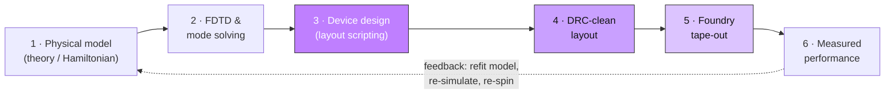

# Integrated Photonics Design Pipeline — a 101

This is a bird's-eye tutorial on how an integrated-photonics chip goes from
*an idea in a Hamiltonian* to *numbers measured on a probe station*, and
where **this repository** sits in that chain.

The pipeline has six stages:

**This repo lives in stage 3** (highlighted), produces the GDS that feeds
stages 4–5, and is written against the physics targets that come out of
stages 1–2. Each stage is explained below, then mapped back to the repo.

---

## 1 · Physical model — *what do we want the light to do?*

You start from physics, not geometry. The question is: what **Hamiltonian**
(or transfer function, or band structure) do we want the chip to realize?

For this group's topological photonics that usually means a **tight-binding
model**: a lattice of optical resonators ("sites") with hopping between
neighbours, plus an engineered **synthetic gauge field** so that photons
feel an effective magnetic field and the lattice develops topological edge
states. The knobs the model hands downstream are concrete:

- **resonant frequency** of each site → sets ring circumference
- **hopping strength `J`** between sites → sets the ring-to-ring gap
- **on-site loss / quality factor `Q`** → sets bend radius, waveguide width
- **synthetic flux per plaquette** → sets the link-ring geometry

Output of this stage: a **target parameter table**, not a drawing.

> Literature bookend: the tight-binding-lattice-of-rings idea this repo
> builds on is Mittal *et al.*, **Nature** 561 (2018), and the topological
> frequency-comb work in Flower *et al.*, **Science** 384 (2024).

---

## 2 · FDTD & mode solving — *turn physics targets into geometry numbers*

The model says "I need `Q = 10⁶` and hopping `J = 20 GHz`." Simulation turns
those into **micrometres**. Two different solvers, two different jobs:

**Mode solving (2-D, a waveguide cross-section).**
Solve Maxwell's equations on the *cross-section* of a waveguide to find its
guided modes. Outputs:

- **effective index `n_eff`** → how fast the mode propagates → resonance condition
- **group index `n_g`** → sets the free-spectral range `FSR = c / (n_g · L)`
- **mode profile** → how far the evanescent tail reaches → coupling vs. gap
- **single-mode width window** → the safe waveguide width (≈ 1.2 µm on AN800)

Tools: Lumerical MODE, Tidy3D mode solver, femwell, MPB.

**FDTD (3-D, a full device).**
Finite-Difference Time-Domain: march Maxwell's equations on a 3-D grid and
watch a pulse propagate through an *actual device*. Use it for the things a
cross-section can't tell you:

- coupler transmission vs. gap (the `J` ↔ gap calibration)
- bend loss vs. radius (validates the Euler-bend choice)
- grating-coupler / edge-coupler insertion loss and bandwidth

Tools: Lumerical FDTD, Tidy3D, Meep.

Output of this stage: a **filled-in geometry table** — radius, width, gap,
coupler length — the exact numbers you will type into the layout script.

> The AN800 PDK ships compact models (`an800/models/*`, built on `sax`/`jax`)
> for exactly this step, but they require a GDSFactory+ licence. This repo
> does **not** run them — it consumes numbers produced elsewhere.

---

## 3 · Device design — *draw the chip, in code*  ⟵ **this repo**

Now you translate the geometry table into an actual layout: polygons on
specific layers, connected into rings, chains, and lattices, wired out to
optical I/O. Modern practice is **layout-as-code** rather than mouse-drawing,
so the design is parametric, diff-able, and reproducible.

This is exactly what the repo does, with **gdsfactory**. The building blocks,
bottom-up:

| Concept | In the repo |
|---|---|
| waveguide cross-section (width + layer) | `cross_section(width=..., layer=(2,0))` |
| low-loss 90° bend | `bend_euler` (curvature ramps smoothly → less scatter) |
| resonator (a "site") | `ring_resonator_euler` — four Euler bends + four straights |
| bus waveguide / I/O | `io_Coupler_*`, edge or grating coupler |
| 1-D coupled-ring chain (a CROW) | `ring_chain` — the tight-binding chain |
| 2-D IQHE / AQHE lattice | `## AQHE / IQHE lattice` cell — the real topological device |
| ring-of-rings plaquettes | `## IQHE - ring of rings` cell |

Two ideas do all the work:

1. **`cross_section` = a recipe; `straight`/`bend`/`taper` = parts extruded
   along a path.** Shape and trajectory are separated.
2. **`connect("o1", other.ports["o2"])` = assembly by *relationship*, not
   coordinates.** You say "this port mates to that port" and gdsfactory
   computes the placement. Ring-to-ring spacing, however, is set by explicit
   `move()` — because the whole point of evanescent coupling is a precise,
   sub-micron *gap*, which must not be a hard connection.

Physical thread to keep in view: **one ring = one tight-binding site; the
sub-micron gap = the hopping `J`.** A 1-D chain is a 1-D lattice; tile it in
2-D and add flux via the link rings and you have the quantum-Hall lattice in
the repo's title.

Output of this stage: a **GDS file** — the universal layout interchange
format the rest of the pipeline speaks.

---

## 4 · DRC-clean layout — *will the foundry actually make it?*

A geometry can be physically sensible yet **unmanufacturable**. Design Rule
Checking (DRC) verifies the layout against the foundry's process limits:

- minimum feature width and spacing
- minimum bend radius
- enclosure / density rules
- required boundary layers, single top cell, on-grid coordinates

**This is a complete local loop — you do not wait for the foundry to reject
it.** The Ligentec AN800 PDK ships its own KLayout technology package
(`LIGENTEC_AN800_PDK_CUSTOM_KLAYOUT_v8.8`) containing the authoritative rule
decks, and they run in **free KLayout** — no GDSFactory+ licence involved
(they are KLayout Ruby macros, unrelated to the licence gate on the edge
notebook's PDK *Python* API). The workflow:

1. KLayout → **Tools → Manage Technologies** → right-click → **Import
   Technology** → load the foundry `200mm_LIGENTEC_AN800.lyt`
2. **Select and apply** the technology (this also loads `.lyp`, so layers show
   in Ligentec colours)
3. press the **DRC** button (runs `Buttoned_DRC_AN800.rb` — geometric rules)
   and the **DSC** button (Design Submission Check: a suite of
   `CHSCSLCheck`, `CellSizeCheck`, `BBRCheck` black-box replacement,
   `PDKLayerCheck`, `EmptyCellCheck`, `LongCellNameCheck`,
   `DegenerateBoundaryCheck`, `originDetection`)
4. read the errors, **fix the layout locally**, re-run until clean
5. only a clean design is handed to the foundry

Passing this deck ≈ passing the foundry's own gate, because it *is* the
foundry's own rule set.

Where the repo feeds into this loop:

- geometry is drawn on the **Ligentec AN800 layers** (X1P = waveguide `(2,0)`,
  CHS = chip frame `(100,0)`, CSL = dicing line `(100,2)`) — so `PDKLayerCheck`
  and `CHSCSLCheck` pass
- the top cell is named **`TOP`** and the design provides the mandatory
  **CHS/CSL** boundary layers (Ligentec submission requirements)
- `write_gds(..., with_metadata=False)` produces a **single clean top cell**
  (no `$$$CONTEXT_INFO$$$` wrapper), which `gdstk.top_level()` verifies and
  which keeps `EmptyCellCheck` / origin checks happy

In other words, the notebook's fussy details — `TOP` naming, CHS/CSL layers,
a single clean top cell — exist precisely to satisfy the DSC deck. The rule
decks themselves live in the PDK (outside this git), but running them locally
is a normal, licence-free part of the flow: treat this stage as
**"locally DRC/DSC-signed-off before tape-out."**

---

## 5 · Foundry tape-out — *hand the file over*

"Tape-out" (a reel-of-tape-era name) is the moment you freeze the design and
submit the GDS to the foundry for fabrication, usually on a shared
**MPW** (multi-project wafer) run to split mask cost.

Practicalities the repo already reflects:

- a versioned tape-out filename, e.g. `2404_UMAR_80040_AN200_v4.gds`
  (date · user · project · process · revision)
- the chip must fit the MPW die frame (Ligentec CHS/CSL sizes, e.g. a
  half-die of 5.19 × 4.85 mm) — check with `c_QHE.bbox`
- black-box PDK cells (the edge coupler) are placed by their **exact library
  name** so the foundry can swap in the real, confidential structure before
  fabrication

Output: silicon-nitride chips, weeks later.

---

## 6 · Measured performance — *did it work, and close the loop*

The fabricated chip goes on a setup: light is coupled in (edge or grating
coupler), swept in wavelength, and the transmission spectrum recorded.

- **through / drop spectra** → resonance positions, `FSR`, loaded `Q`
- **band structure** → for a lattice, the split resonances trace the photonic
  band; topological samples show mid-gap **edge-state** transmission
- **synchronization / nonlinear behaviour** → higher-power measurements

The measured numbers feed *back* into stage 1: refit the model, correct the
simulation, and re-spin geometry for the next tape-out. The pipeline is a
**loop**, not a line.

> Measurement bookends for this group's rings-on-a-lattice: Xu *et al.*,
> **Science Advances** 11 (2025) (on-chip optical synchronization) and
> Jalali Mehrabad *et al.*, **Science** 390 (2025) (frequency-phase matching).

---

## The repo, in one sentence per stage

| Stage | This repo's role |
|---|---|
| 1 · Physical model | *consumes* — the tight-binding / topological targets from the literature above |
| 2 · FDTD & mode solving | *consumes* — geometry numbers (radius, width, gap) produced elsewhere |
| **3 · Device design** | **owns it** — gdsfactory layout of rings → chains → IQHE/AQHE lattices, with edge or grating I/O |
| 4 · DRC-clean layout | *feeds & is signed off locally* — GDS is drawn to pass the PDK's DRC/DSC decks, which run in free KLayout (decks live in the PDK, outside git) |
| 5 · Foundry tape-out | *produces* — the versioned GDS on the Ligentec AN800 process |
| 6 · Measured performance | *feeds* — the devices whose spectra become the physics results |

### In this git vs. outside it

| In the repo | Outside the repo (but part of the flow) |
|---|---|
| the two design notebooks (stage 3) | physical model / theory — stage 1 (literature) |
| the tape-out GDS they produce (stage 5) | FDTD & mode-solving files — stage 2 |
| README + this tutorial | the **Ligentec AN800 PDK** (wheel + black-box GDS) — on Google Drive |
| | the **KLayout tech + DRC/DSC decks** (`.lyt`/`.lyp`/`.rb`) — in the PDK folder |
| | measurement data — stage 6 (probe station) |

So the repo *owns* layout code and the GDS, *runs* DRC locally using
foundry-supplied decks that live outside git, and connects to the physics and
measurement stages that are not files at all.

The two notebooks are the same design with different optical I/O:

- **`QHE lattice - grating couplers.ipynb`** — pure gdsfactory, no PDK; fibre
  couples from *above* via a grating. Narrower band, easy alignment.
- **`QHE lattice - edge couplers.ipynb`** — uses the Ligentec AN800 PDK edge
  coupler; fibre couples from the *side*. Broadband, lower loss, harder
  alignment — the right choice for wide spectral sweeps.

---

## Local environment (both notebooks)

- **Python 3.12** in a dedicated conda env (`an800`)
- **gdsfactory `~=9.14.0`** (pinned by the PDK; tested 9.14.2)
- the grating notebook needs nothing more
- the edge notebook additionally needs the **Ligentec AN800 PDK**
  (`an800-gdsfactory`, obtained from the foundry, not in this repo). Its
  Python API is licence-gated (GDSFactory+); the notebook falls back to the
  edge-coupler GDS shipped inside the PDK, which needs no licence.
